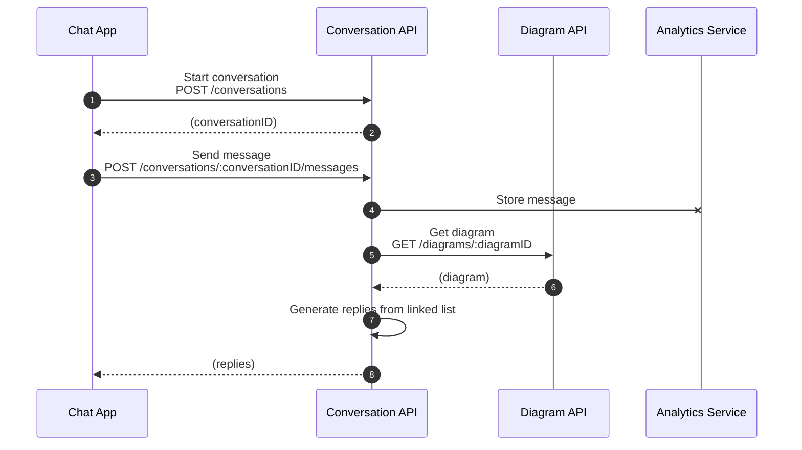

# Exam Notes

## Introduction

Hello! I prepared this notes as a guide on how I think and why I made certain decisions while developing my solution for the exam. Most of the files also have inline comments.

## Setup

Install dependencies

```sh
yarn
```

## Run

_Diagrams API_
```sh
yarn workspace diagrams dev
# Runs on http://localhost:4000
```

_Conversations API and Frontend Server_
```sh
yarn workspace conversations dev
# Runs on http://localhost:3000
```

Open the frontend at http://localhost:3000


## Evaluation

### Interface Design

**REST API Standards**

There are a few changes that have been applied to comply better with REST API standards.

1. Renamed `/conversation` to `/conversations`.
2. Moved `diagramID` from the route URL parameter to the request body (see Separation of Concern below).

**TypeScript Interfaces**

Fixed some of the TypeScript interfaces that had missing properties (https://github.com/hyubs/interview-take-home-platform/commit/12cff2ff0cdf33e4e5a7182d7d48a5198d8e5ac8).

**Code Architecture**

In general, I followed the monorepo and Nest.js setup in my code.

1. New API serices have thier own workspace directories (i.e., `./backend/conversations`, `./backend/diagrams`).
2. Features of the same topic were grouped by modules.
3. Each file type represents a layer in the code architecture and has their own responsibility:
    1. controllers - Responsible for receiving the request and orchestrating the general logic until the API responds.
    2. services - Manages the detailed business logic.
    3. repositories - Interface between a service and the database.
4. Common resources were placed in `./resources`.

### Separation of Concern

**Conversations API and Diagrams API**

I decided to divide the original service into two: conversations and diagrams. The original API endpoint, `POST /conversation/:diagramID`, had "conversations" tightly coupled with "diagrams."

This decision was made based on the assumption that the Chat App will be used by the customers of Voiceflow's clients. And the diagrams will somehow come from the AI Builder. These 2 systems are serving distinct users thus a strong case can be made to separate conversations and diagrams.

Message is another entity. Messages have a strong association with a conversation (a message always belongs to a conversation). That is why the new API route is `POST /conversations/:conversationID/messages`.

Because of these changes, the flow of the monorepo now looks like this:



_Notes:_
1. "Start conversation" (steps 1 & 2) is not called by Chat App in the code. I opted to reduce the changes in the `./frontend` directory. This is because this exercise focuses on the backend and I am assuming that the frontend might belong to a different team. We would need to communicate with that team to relay our API changes.
2. A separate Analytics Service does not exist. In the code, this is represented by a module inside the Conversation API.

### "Build vs Buy"

Majority of the code was built using existing libraries. For example, instead of writing validation logic from scratch, I used `class-validator`. Not only does this save time, but it is also more secure long term because we are able to leverage on the benefits of the open source community.

There are cases when using existing libraries may not be the best solution. Parsing the linked list to get replies had to be done manually because the task was simple and using an external library would just add complexity. Other reasons such as "how well maintained is the open source library," security risks, etc., should be considered as well.

## TODOs

I didn't have enough time to add these. I opted to leave them for now because I wanted to strictly follow the estimated time for this exam and focused more on what are noted in the Evaluation (README).

1. Tests
2. Securing the APIs
3. Documentation
4. Separate the frontend server from Conversations API.

Let me know if you need me to code these. We can also discuss how I would implement this based on the exam.

## Environment

* node.js @ 18.14.2
* yarn @ 3.6.1
